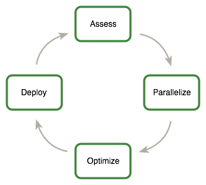

# 1. What is This Document?
本指南用于帮助开发者在支持NVIDIA® CUDA® 的GPUs上获得最佳的性能体验。指南中介绍了可行的并行化和优化技术，并解释了那些可以大大简化在支持CUDA的GPU架构上进行编程涉及到的编码隐喻和习语。

本指南的的内容也可以作为你的参考手册，不过需要提前说明的是，随着文中对不同编程或者配置主题的探讨，某些话题将会在不同话题下被反复提及。因此，强烈建议第一次阅读本指南的读者严格按照章节顺序阅读。遵照此法讲极大提升您对高效编程实践的理解，并使您后续将本指南作为参考时使用起来更加得心应手。

# 2. Who Should Read This Guide?
文中的讨论均基于C++编程语言展开，因此，您应该能够流畅阅读C++代码。

本指南中穿插了一些其他文档的内容，不过不用担心，这些文档均可以不费吹灰之力的在[CUDA官方网站](https://docs.nvidia.com/cuda/)中找到。在本指南中，以下文档的内容需要重点关注：
- *CUDA Installation Guide*
- *CUDA C++ Programming Guide*
- *CUDA Toolkit Reference Manula*

需要特别说明的是，本文的优化章节假设您早已成功下载并安装了CUDA Toolkit(如若不然，请参考适宜你的操作系统的《CUDA Installation Guide》),同时，也假设您对CUDA C++编程语言和环境有基础的了解(如若不然，请参考《CUDA C++ Programming Guide》)。

# 3. Assess, Parallelize, Optimize, Deploy
本指南引入Assess，Parallelize, Optimize, Deploy(APOD)的程序设计流程，以帮助程序开发者快速识别出哪些部分最有可能从GPU并行加速中受益，最短时间可以落地，并尽可能早地将加速成果部署到生产环境中。

APOD是一个不断循环的设计流程：以最少的时间投入获得初始加速效果后，测试并完成部署后，便又可以开始新一轮的评估以发现后续的优化机会，展望新一轮的加速效果，并将加速后的版本快速部署到生产环境中。



## 3.1 Assess
对于现有项目，第一步是评估并定位出当前项目中主要耗时的那部分代码。有了对这一情况的把握以后，开发人员便可以着手评估这部分项目瓶颈的并行化可行性，并开始进行GPU并行加速的尝试。

一般的，基于对最终用户群体需求和制约因素的了解，并结合[Amdahl’s Law](https://en.wikipedia.org/wiki/Amdahl%27s_law) 以及[Gustafson's Law](https://en.wikipedia.org/wiki/Gustafson%27s_law)，开发人员可以得出程序加速效果的性能上限。

## 3.2 Parallelize
当识别出程序的热点代码（即造成性能瓶颈的那部分代码），且已经通过基础的测试设定优化的目标和预期后，开发人员便需要并行化这部分代码。根据初始代码的情况，这一环节有可能简单到仅仅是调用现有GPU优化的库，比如[cuBLAS], [cuFFT], 或者[Thrust]等, 又或者是在代码中加入一些预编译指令以更好地发挥并行编译器的优化能力。

当然还有另外一种较为麻烦的情况，一些程序的设计需要重构才能暴露出其并行性。不过，哪怕是CPU架构也会要求程序有一些并行性以
提升或者是保持串行程序的性能，CUDA系列编程语言（如CUDA C++， CUDA Fortran，等等）都致力于尽量简化并行性的表达式，但是同时尽量最大化支持CUDA的GPUs的并行性。

## 3.3 Optimize
当每轮程序并行工作结束时，开发人员便可将注意力转到应用的优化工作上来提升性能。由于有很多优化策略可以纳入考虑范围，对程序需求具有的理解越好将会使得这一环节丝滑如德芙。然而，正如APOD是一个不断循环的过程一样，程序优化也是一个需要不断迭代的过程（识别优化机会，应用并测试优化方案，验证加速的效果，不断循环往复）。这就意味着，并没有必要花大量的时间来记忆所有的优化策略，而是在应用这些策略时逐步的理解吸收。

优化可以在不同的层级上进行，从重叠计算和数据传输到调优浮点数运算指令。性能分析工具给这一阶段工作带来了无限价值，诸如对于开发者的优化工作而言他们可以指明方向并对相关优化代码的性能指标进行量化。

## 3.4 Deploy
当完成了应用程序中一个或多个模块的GPU加速工作后，很有必要将优化效果和一开始的预期进行对比。重新回顾一开始的[Assess]环节允许开发者确定加速热点代码的潜在加速上限。

当对其他热点代码优化以使整个程序速度更快之前，建议开发人员考虑将优化后的代码部署到实际的生产环境中。基于以下几点，这一举动十分重要：例如，可以使用户尽早的从他们的投资中受益（虽然只是对部分进行加速，但是也具有实用价值）。与此同时，相较于一下子引入大量的修改，逐次引入将最小化开发者引入BUG的风险。

# 4. Recommendations and Best Practices
本指南对如何设计和应用CUDA C++ 代码提供了一些具体且切实可行的建议。这些建议以实施的效果和适用的应用场景为依据按照优先级逐一给出。对大部分CUDA应用具有显著效果的建议具有最高的优先级，相应的，仅在特点场景下有效的方案优先级较低。

在应用较低优先级的建议之前，比之优先级更高的建议应该全部已经实践过会是极好的。从投入时间角度和避开过早优化陷阱的角度考虑，这将使最终结果尽量是好的。

需要注意的是，确定优先级效果和范围的标准随着程序的不同会有所不同。因此，本指南中仅讨论了一些典型情况，您的代码在优先级上可能并不完全相同。无论是哪种情况，一条亘古不变的原则是：在应用低优先级优化策略之前，应该确保高优先级的策略已经得到了实施和验证。

```
注：为了简洁起见，本文中的示例代码省略了错误检查。
然而，在真实的生产场景中，通过[cudaGetLastError()]对每个API调用返回的错误码以及kernel函数是否启动失败进行检查都是必须的。
```